# GDS Blender Pipeline

Convert GDS layouts into editable Blender scenes and reproducible PNG renders.

**Current PDK workflow:** AIM Photonics. GDS import and extrusion use the
external [GDSII Importer](https://extensions.blender.org/add-ons/import-gdsii/),
which accepts configurable PDK layer stacks.

<table>
  <tr>
    <td>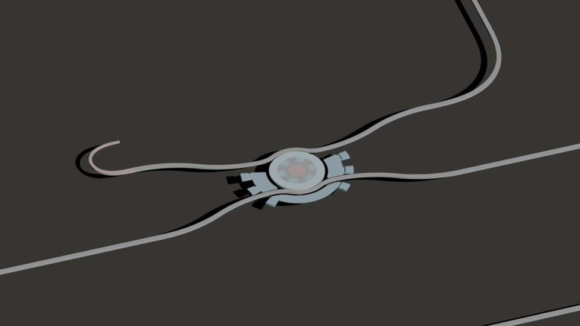</td>
    <td>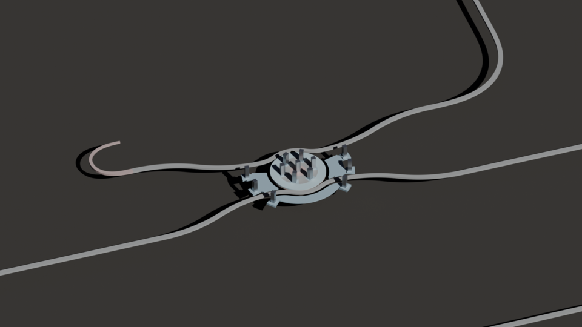</td>
    <td>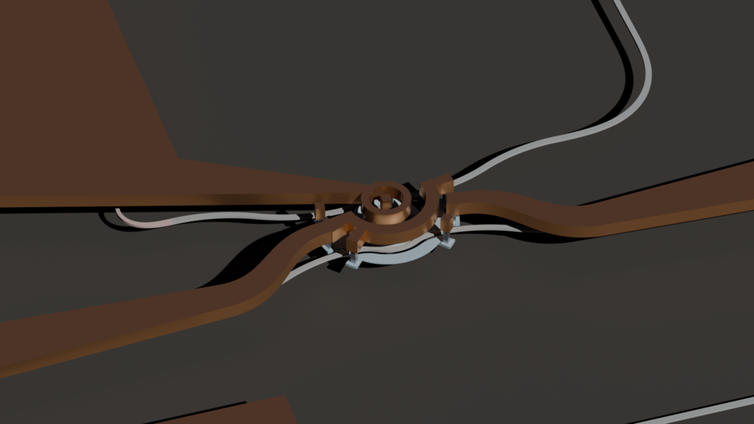</td>
  </tr>
  <tr>
    <td>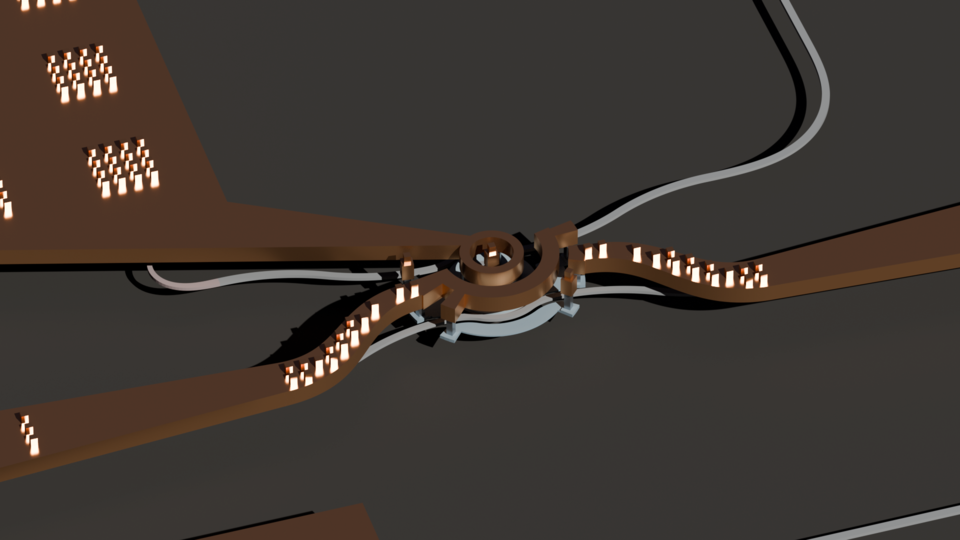</td>
    <td>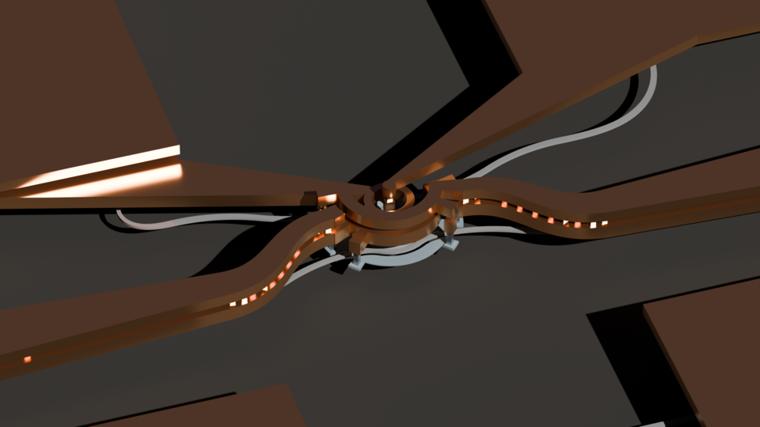</td>
    <td>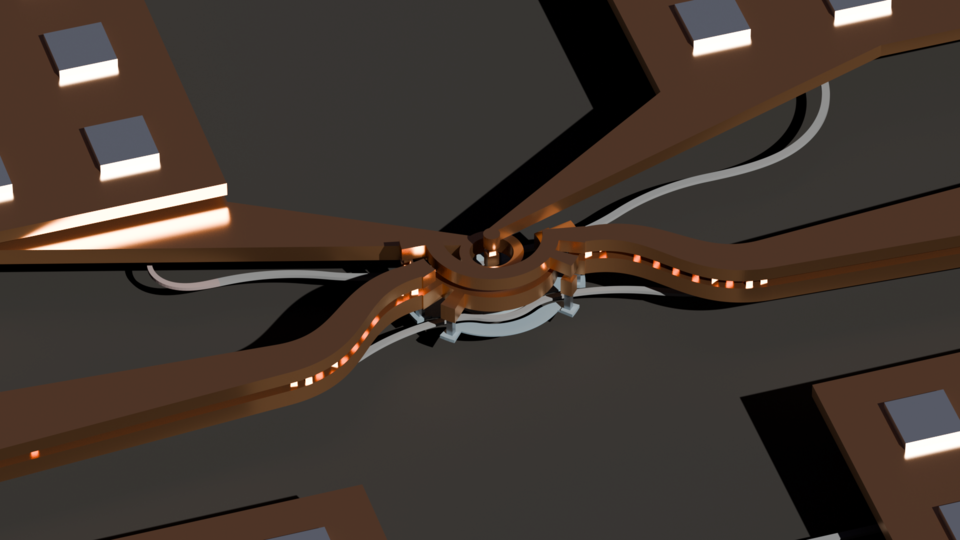</td>
  </tr>
  <tr>
    <td>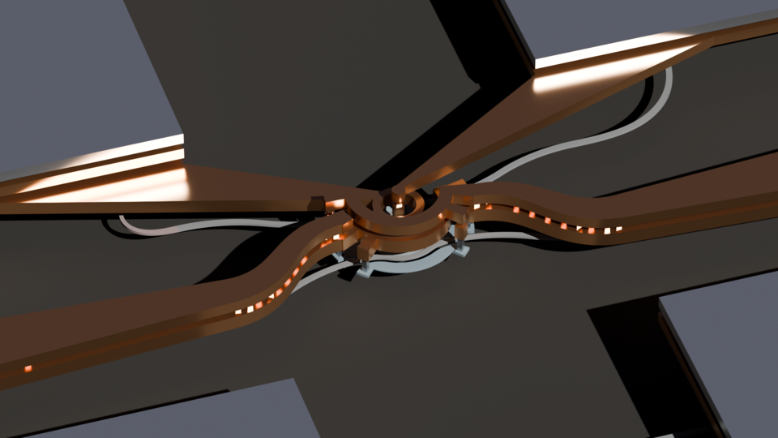</td>
    <td>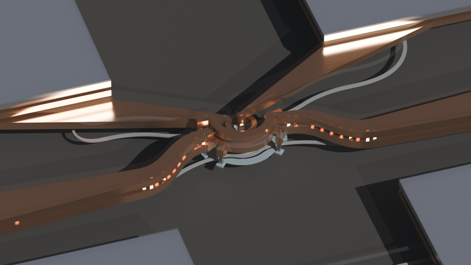</td>
    <td>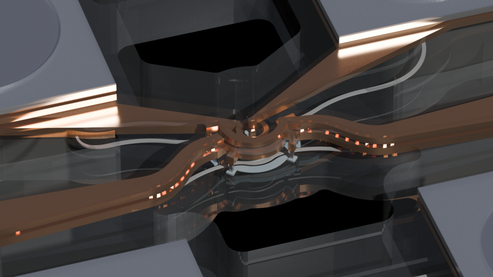</td>
  </tr>
</table>

## Dependencies

- Conda or Mamba
- `make`
- Blender
- [GDSII Importer](https://extensions.blender.org/add-ons/import-gdsii/),
  installed and enabled in Blender

```sh
make env
make env-info
```

If Blender is not on `PATH`, add `BLENDER=/path/to/blender` to Make commands.

## Required Files

| File | Description |
| --- | --- |
| `external_pdks/AIMPhotonics_ACT1/tech.py` | AIM technology file containing `LayerMapAIM` |
| `configs/aim/raw_custom_layers.yaml` | Custom raw-layer markers |
| `configs/aim/doping_rules.yaml` | Silicon and doping rules |
| `configs/aim/render_layers.static.yaml` | Static render layers and z stack |
| `path/to/layout.gds` | Layout to render |

The registry, BlenderGDS stack, visualization GDS, Blender scene, and renders
are generated locally and ignored by Git. See
[Configuration Syntax](docs/advanced-usage.md#configuration-syntax)
for the YAML formats.

## First Render

Run all commands from the repository root.

### 1. Build The Scene

```sh
make aim-build GDS=path/to/my_cell.gds
```

Scene:

```text
.local/runs/my_cell/blender/my_cell.realistic.blend
```

The default color scheme is `realistic`; standard geometry settings are
applied automatically.

### 2. Choose A Camera View

```sh
blender .local/runs/my_cell/blender/my_cell.realistic.blend
```

- Compose the desired view in the 3D Viewport.
- Select `Camera`, then choose **View > Align View > Align Active Camera to
  View** (`Ctrl` + `Alt` + `Numpad 0`).
- Record its **Location**, **Rotation**, and **Focal Length**.

### 3. Create A Preset

Create `configs/blender/render_presets/my_view.yaml` and replace the camera
values:

```yaml
version: 1
name: my_view

camera:
  object: Camera
  type: PERSP
  location: [100.0, -200.0, 300.0]
  rotation_degrees: [35.0, 0.0, -25.0]
  lens_mm: 100.0

render:
  engine: CYCLES
  samples: 64
  denoise: true
  file_format: PNG

output:
  directory: .local/runs/my_cell/renders

runs:
  - name: all_layers
    hide_layers: []
```

Camera rotations are in degrees. Increase `samples` after the first test
render if needed.

### 4. Render The PNG

```sh
make aim-render \
  GDS=path/to/my_cell.gds \
  PRESET=configs/blender/render_presets/my_view.yaml
```

Output:

```text
.local/runs/my_cell/renders/my_cell.realistic.my_view.all_layers.png
```

## TUAM And PAAM Options

| Final geometry | Build options | Scene |
| --- | --- | --- |
| TUAM undercut + PAAM opening | Default | `my_cell.realistic.blend` |
| TUAM undercut only | `PASSIVATION_OPENING=0` | `my_cell.no-passivation-opening.realistic.blend` |
| PAAM opening only | `UNDERCUT=0` | `my_cell.no-undercut.realistic.blend` |
| Neither | `UNDERCUT=0 PASSIVATION_OPENING=0` | `my_cell.no-undercut.no-passivation-opening.realistic.blend` |

```sh
make aim-build GDS=path/to/my_cell.gds UNDERCUT=0 PASSIVATION_OPENING=0
```

`UNDERCUT=0` preserves the substrate and cladding at TUAM while retaining DIAM
processing. `PASSIVATION_OPENING=0` preserves the passivation cap at PAAM. Pass
the same options to `aim-render`.

## Color Schemes

*All layers using a 100 mm lens.*

| Realistic (default) | Fancy | Marketing |
| :---: | :---: | :---: |
| 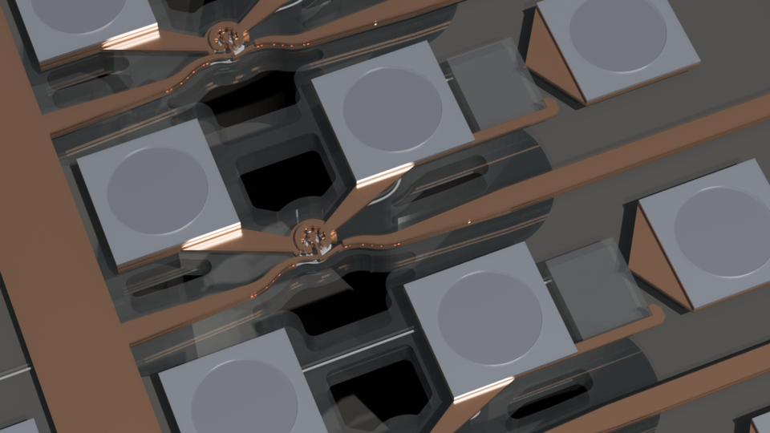 | 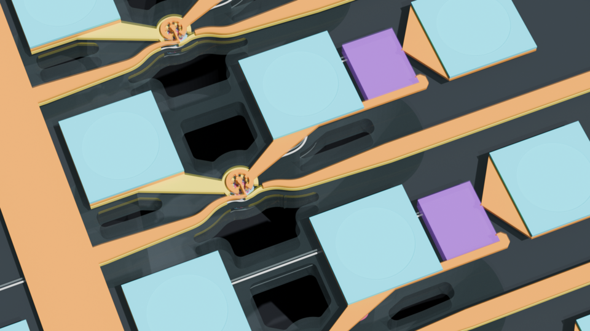 | 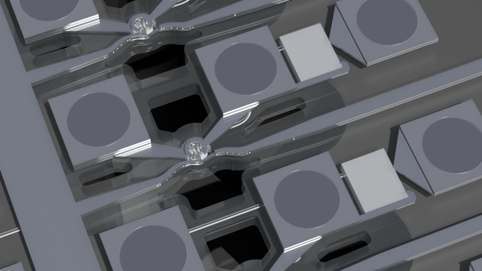 |

```sh
make aim-build GDS=path/to/my_cell.gds SCHEME=fancy
```

Pass the same `SCHEME` to `aim-render` to render that scene.

## File Structure

```text
.local/runs/<design>/
├── visual/              # internal visualization GDS
├── blender/             # editable scenes
└── renders/             # PNG renders
```

## Advanced Usage

See [Advanced Usage](docs/advanced-usage.md) for direct commands, render runs,
geometry controls, farm/HPC export, Make variables, cleanup, and troubleshooting.

## Common Errors

| Error | Fix |
| --- | --- |
| Missing `tech.py` | Supply the PDK tech file or set `AIM_TECH` |
| BlenderGDS operator unavailable | Install and enable GDSII Importer in the selected Blender installation |
| Missing preprocessing layer | Check the tech file, `raw_custom_layers.yaml`, and render expressions |
| Missing preset layer | Use layer names present in the generated scene |
